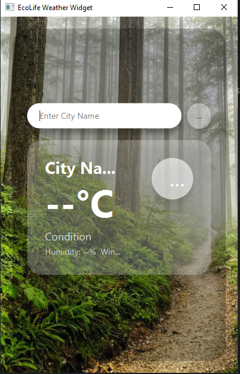

# Branded Weather Widget - EcoLife Solutions

A simple weather widget application for EcoLife Solutions, displaying the current weather conditions with a branded background.

## Features

- Displays current weather information.
- Branded user interface with a background image.
- Simple and easy-to-use interface.

## Getting Started

To get started with this project, clone the repository and open it in your favorite Java IDE.

### Prerequisites

- Java Development Kit (JDK) 8 or higher
- JavaFX

### Running the Application

1.  Open the project in your IDE.
2.  Locate the `Launcher.java` file in `src/main/java/org/example/brandedweatherwidget/`.
3.  Run the `main` method in the `Launcher` class to start the application.

## Screenshot

